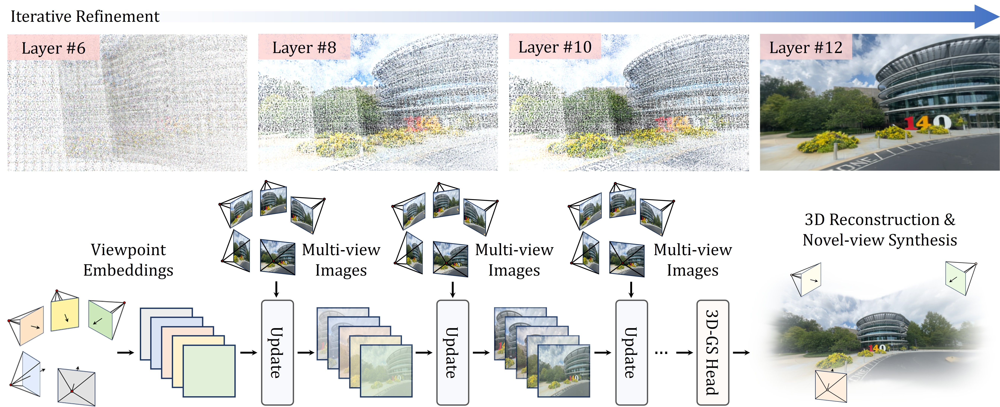

<h1>iLRM: An Iterative Large 3D Reconstruction Model</h1>

[Gyeongjin Kang](https://gynjn.github.io/info/), [Seungtae Nam](https://github.com/stnamjef), [Xiangyu Sun](https://scholar.google.com/citations?user=VLzxTrAAAAAJ&hl=ko&oi=ao), [Sameh Khamis](https://www.samehkhamis.com), [Abdelrahman Mohamed](https://www.cs.toronto.edu/~asamir/), [Eunbyung Park](https://silverbottlep.github.io/index.html)

Official repo for the paper "**iLRM: An Iterative Large 3D Reconstruction Model**"

